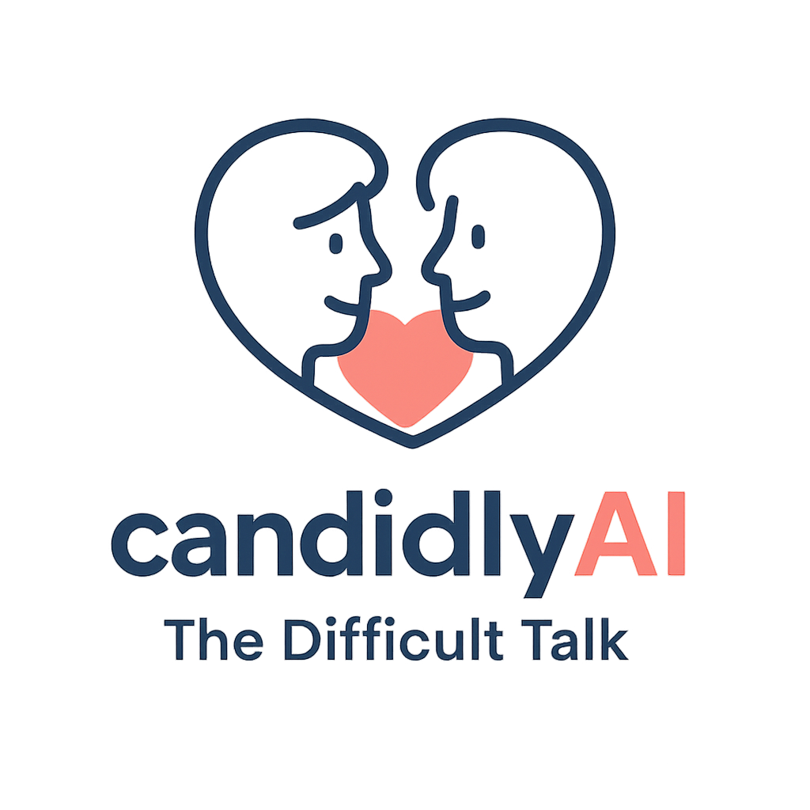

<p align="center">
  
</p>
<p align="center">
  Practice tough conversations safely with a human–AI platform and gentle, real-time guidance.
</p>

<p align="center">
  <a href="https://www.canva.com/design/DAG27AZRI_U/nN6qcksGsKJ4i0qjNGV8_Q/edit?utm_content=DAG27AZRI_U&utm_campaign=designshare&utm_medium=link2&utm_source=sharebutton">Pitch Deck</a> •
  <a href="#demo">Demo</a> •
  <a href="#quickstart">Quickstart</a> •
  <a href="#team">Team</a>
</p>

---

## Why this project
- **Hard conversations are avoidable until they’re not.** People fear saying the wrong thing.
- **Practice helps.** Rehearsal with feedback improves clarity, tone, and confidence.
- **We simulate the stakes.** Realistic personas + live coaching = safer, kinder outcomes.

---

## Demo

---

## Features

* 🎭 **Role-play difficult talks** with configurable personas, stakes, and relationship context
* 🧭 **Live guidance** on tone, phrasing, and intent—flags risky wording and suggests safer/clearer options

---

## Quickstart

```bash
# 1) Clone
git clone https://github.com/<org-or-user>/candidlyAI.git
cd candidlyAI

# 2) Setup (choose one)
# Python
python -m venv .venv && source .venv/bin/activate
pip install -r requirements.txt

# 3) Configure
cp .env.example .env
# Fill in keys

# 4) Run (To Update)
python main.py